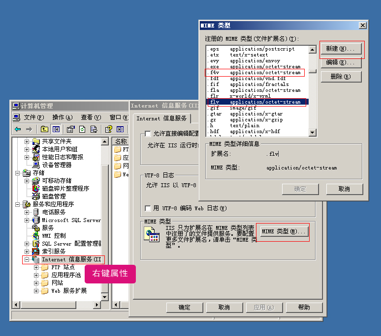

# iis发布含有视频的网站

win2003下
打开IIS，然后在 mypc（本地计算机） 上面点击右键属性（很多帮助文件都没有说这一点，很多人以为是在站点上面点击右键，却发现找不到MIME类型，其中mypc是你的计算机名）
图片点击可在新窗口打开查看
然后点击“MIME类型”，接着点击新建，
flv格式是加入关联扩展名：.flv，内容类型：application/octet-stream
f4v格式是扩展名：.f4v，内容类型：application/octet-stream
mp4格式是扩展名：.mp4，内容类型：video/mp4
要注意的是，内容类型并不是跟扩展名配套的，你起别的名称一要，只是做个说明而已
确定以后，服务器就可以支持FLV,f4v,mp4视频播放了，如果依然不可以的话，可以尝试重新启动IIS！
win7的iis里
默认支持flv文件 调用使用时路径用绝对路径就可以了，比如你的视频在video/a.flv的，请直接用/video/a.flv，如果需要支持f4v,mp4请参考2003的设置

 
 
转载:ckplayer.com
 