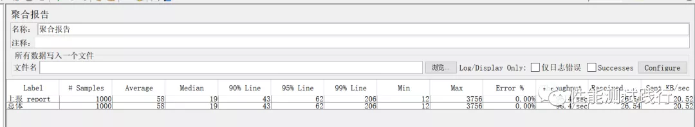

# jmeter测试

> 引用: https://blog.csdn.net/qq_41612292/article/details/100862492

从外部看，性能测试主要关注如下四个指标:
* 1、吞吐量：每秒钟系统能够处理的请求数、任务数。
* 2、响应时间：服务器处理一个请求或一个任务的耗时。
* 3、错误率：一批请求中结果出错的请求所占比例。
* 4、带宽：每秒从服务器端接收到的数据量（KB/s）

jmeter的聚合报告

* 1、响应时间：聚合报告中包含Average、Median、90%Line、95%Line、99%Line、Min、Max四个时间指标，它们的值越小效果越好，表示接口响应越快。但是在实际工作中我们一般会关注90%Line这个值，表示90%的响应时间是小于43ms，Average对应的平均响应时间参考意义不大，一般我们不参考这个值。
* 2、吞吐量：在聚合报告中是指Throughput这项（即TPS），表示服务器分秒处理请求数或任务数。该值越大越好，表示服务器处理能力越强。
* 3、错误率：聚合报告中是指Error%（错误率=错误的请求的数量/请求的总数），错误率越低越好，为0表示没有异常请求。对于一般业务来说错误率要在万分之一以下。考虑到不同业务的区别，这个万分之一的标准可能会有变化。
* 4、带宽：在聚合报告中指Recived(KB/s)，表示从服务器端接受返回数据所占网络带宽。这个值一般要求越小越好，越小占用带宽越小，间接的表示服务器端返回数据较小。一般内网环境也就是千兆带宽，如果该值过大时，需要考虑优化。