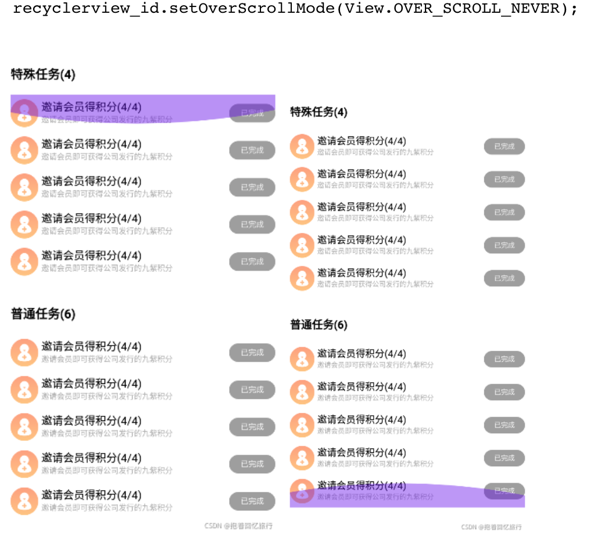

# Android recyclerview

setOverScrollMode

setOverScrollMode(View.OVER_SCROLL_NEVER)

设置此模式，滑到边界后继续滑动也不会出现弧形光晕

setOverScrollMode(View.OVER_SCROLL_ALWAYS)

设置此模式，滑到边界后继续滑动也总是会出现弧形光晕

setOverScrollMode(View.OVER_SCROLL_IF_CONTENT_SCROLLS)

设置此模式，如果recycleview里面的内容可以滑动，那么滑到边界后继续滑动会出现弧形光晕；如果recycleview里面的内容不可以滑动，那么滑到边界后继续滑动不会出现弧形光晕.

