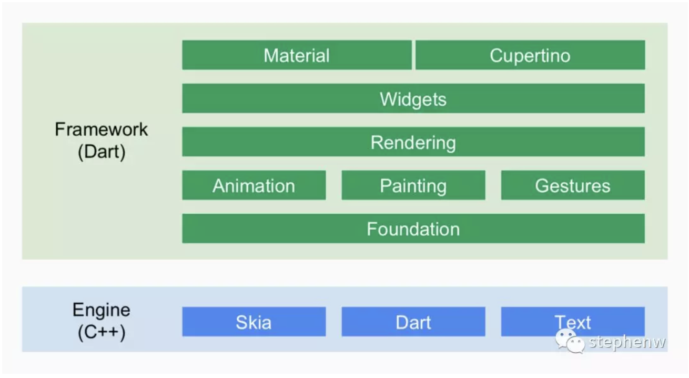
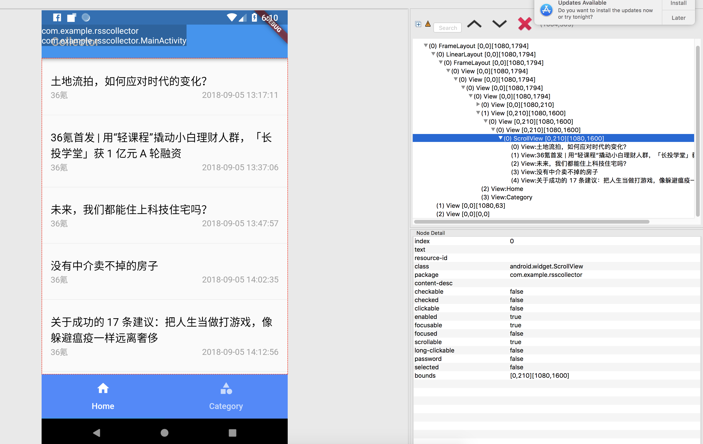
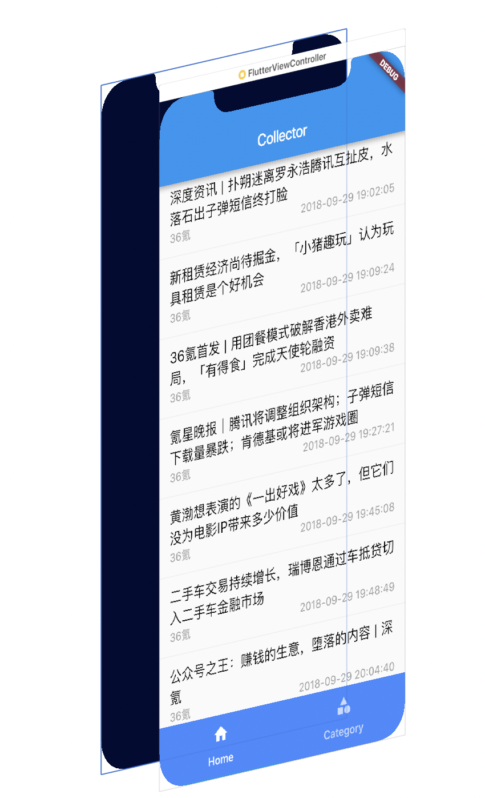

# Flutter是什么

Flutter是Fuchsia的开发框架，是一套移动UI框架，可以快速在iOS、Android以及Fuchsia上构建高质量的原生用户界面。是一套建立在 Skia 图形库上，提供实际呈现的部件，而不仅仅是原生控件的包装的框架。

Flutter不使用浏览器技术，也不使用Native的原生控件，它使用自己的渲染引擎来绘制widget。对于Android平台，Flutter引擎的C/C++代码是由NDK编译，在iOS平台，则是由LLVM编译，两个平台的Dart代码都是AOT编译为本地代码，Flutter应用程序使用本机指令集运行。

## Flutter设计

Flutter Framework: 这是一个纯 Dart实现的 SDK，类似于 React在 JavaScript中的作用。它实现了一套基础库， 用于处理动画、绘图和手势。并且基于绘图封装了一套 UI组件库，然后根据 Material 和Cupertino两种视觉风格区分开来。这个纯 Dart实现的 SDK被封装为了一个叫作 dart:ui的 Dart库。我们在使用 Flutter写 App的时候，直接导入这个库即可使用组件等功能。

Flutter Engine: 这是一个纯 C++实现的 SDK，其中囊括了 Skia引擎、Dart运行时、文字排版引擎等。不过说白了，它就是 Dart的一个运行时，它可以以 JIT、JIT Snapshot 或者 AOT的模式运行 Dart代码。在代码调用 dart:ui库时，提供 dart:ui库中 Native Binding 实现。

# Flutter为什么使用

Flutter跟大部分构建移动应用的技术或者框架不同的是，Flutter没有使用WebView或者平台自带的控件，相反Flutter使用自身的高性能渲染引擎绘制自己的控件。

另外，Flutter仅仅只有小部分C++代码，Flutter使用Dart实现了它自身大部分功能（控件，动画，手势，compositing等等）。这样开发者能够容易阅读，修改Flutter的实现，所以这里提供开发者相当大的空间去控制整个框架而且显著降低入门门槛。

## 特性：

1. 快速开发：Flutter的热重载可以快速地进行测试、构建UI、添加功能并更快地修复错误。
2. 富有表现力，漂亮的用户界面：自带的Material Design和Cupertino（iOS风格）widget、丰富的motion API、平滑而自然的滑动效果。
3. 响应式框架：使用Flutter的现代、响应式框架，和一系列基础widget，轻松构建您的用户界面。
4. 访问本地功能和SDK：Flutter可以复用现有的Java、Swift或ObjC代码，访问iOS和Android上的原生系统功能和系统SDK。
5. 统一的应用开发体验：Flutter拥有丰富的工具和库，可以帮助开发者轻松地同时在iOS和Android系统中实现想法和创意。
6. 原生性能：Flutter包含了许多核心的widget，如滚动、导航、图标和字体等，这些都可以在iOS和Android上达到原生应用一样的性能。

# Flutter能做什么

Flutter能够开发Android和iOS上2D（不支持3D）界面的移动应用。

你可以使用Flutter开发具有全特性的应用（包含支持照相，定位，网络连接，存储，第三方SDK等等）。

# Flutter适合什么人使用

Flutter框架对于熟悉面向对象编程和命令编程的开发者门槛是相当低的，并不需要有移动应用的开发经验，我们已经见过编程经验不多的人都能学习并使用Flutter开发应用。

# Flutter缺点

暂时对 iOS 效果有点不佳

# Flutter对比

# Flutter相关产品

谷歌在使用Flutter构建一些business-critical（业务相关的）移动应用，例如，谷歌的移动销售工具应用就是使用Flutter开发的，还有Google Shopping Express的Store Manage应用，还有一些应用处于开发中。

# 参考

[http://flutter-dev.cn/topic/16/flutter常见问题答疑](http://flutter-dev.cn/topic/16/flutter常见问题答疑)

