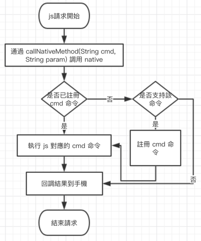

# app 混合開發方案

本方案基於 js 橋接方式作為混合開發，在線下載 html 模板更新 ui，適合在線更新。

需要了解：前端異步請求，了解 html 作為模板與正常網頁製作的區別，了解 iOS Android 場景跳轉

進階開發：js 與 iOS Android  通訊

## 1.設計方案

### 1.1.html下載模板流程


### 1.2.js 與 native 通訊流程



## 2.方案實現

### 2.1服務端開發

#### 2.1.1.文件說明

GlobalValue.js 配置 host，因為打包到手機本地需要完整的請求地址。

HybridJs.js 是封裝好與 native 通訊。

#### 2.1.2.現有接口

| 接口名稱 | 功能說明 |
| :--- | :--- |
| HybridJs.nativeCmdGetH5Params | 獲取上一個頁面的參數。eg:列表進入詳細頁面，詳細頁面根據產品 id 獲取數據。 |
| HybridJs.nativeCmdLoadApi | 通過 native get 請求 api |
| HybridJs.nativeCmdLoadApiPost | 通過 native post 請求 api |
| HybridJs.nativeCmdGetContacts | 獲取手機通訊錄權限 |
| HybridJs.nativeCmdPresentViewH5 | iOS 打開 h5 新頁；Android 打開 h5 activity |
| HybridJs.nativeCmdPushViewH5 | iOS push新頁；Android 添加 fragment |
| HybridJs.nativeCmdPopView | iOS pop；Android pop fragment |
| HybridJs.nativeCmdPopViewToH5 | iOS pop and open new; Android pop fragment and open new |
| HybridJs.nativeCmdPopViewToRoot | iOS pop to root view; Android pop fragment to first fragment |
| HybridJs.nativeCmdDismissView | iOS dismiss view; Android finish Activity |
| HybridJs.nativeCmdLocalNotification | call native notification |

接口數據格式：

```
{
//固定格式，對應命令
"cmd":"CmdLoadApiPost",
//固定格式，js 新加命令（HYBRID_CALLBACK_+命令+時間+隨機數）
"cmd_callback":"HYBRID_CALLBACK_CmdLoadApiPost_1527589130297_7809",
//固定格式，cmd 參數
"cmd_params":
    {
        //api 或 對應文件
        "url":"http://192.168.3.229:9999/api/testrr",
        //api 或 對應文件參數
        "params":
        {
            //自定義結構
            "url":"http://192.168.3.229:9999/api/product/1",
            "params":null
        }
    }
}
```

#### 2.1.3.HybridJs.callNativeMethod 自定義接口

js 調用 native 唯一接口，通過該接口可以實現更多個性化訂製接口，但必須在 native 上聲明協或繼承 HybridCommand，並在事件分發上添加該功能

接口數據格式：

```
{
//固定格式，對應命令"cmd":"CmdLoadApiPost",
//固定格式，js 新加命令（HYBRID_CALLBACK_+命令+時間+隨機數）
"cmd_callback":"HYBRID_CALLBACK_CmdLoadApiPost_1527589130297_7809",
//固定格式，cmd 參數
"cmd_params":
    {
        //自定義參數結構
        //api 或 對應文件
        "id":"http://192.168.3.229:9999/api/testrr",
        //api 或 對應文件參數
        "params":
        {
            "url":"http://192.168.3.229:9999/api/product/1",
            "params":null
        }
    }
}
```

### 2.2.服務端開發流程（以 php 為例子）

#### 2.2.1.版本控制接口

```php
Route::get('/version', function () {
    $version = array(
        'status' => 1,
        'error_code' => 1,
        'info' => '',
        'data' => array(
            'app_name' => 'v0.0.1',
            'last_force_update' => 0,
            'version_code' => 1,
            'source_version_code' => 13,
            'debug_download' => 1
        )
    );
    return json_encode($version);
});
```

#### 2.2.2.壓縮 html 資源和下載接口

```php
function addFileToZip($path, $zip)
{
    $str_array = explode('/', $path);
    $root_dir = '';
//    echo $str_array;
    if (count($str_array) > 0) {
        $root_dir = $str_array[count($str_array) - 1];
    }

    $handler = opendir($path); //打开当前文件夹由$path指定。
    while (($filename = readdir($handler)) !== false) {
        if ($filename != "." && $filename != "..") {//文件夹文件名字为'.'和‘..’，不要对他们进行操作
            if (is_dir($path . "/" . $filename)) {// 如果读取的某个对象是文件夹，则递归
                addFileToZip($path . "/" . $filename, $zip);
            } else { //将文件加入zip对象
                $zip->addFile($path . "/" . $filename, $root_dir . '/' . 
                str_replace('.blade.php', '.html', $filename));
            }
        }
    }
    @closedir($path);
}
```

```php
Route::get('/zip', function () {

$dir = realpath('.');
$a = scandir($dir);
$path_parts = pathinfo(__FILE__);

$dir = realpath('..') . '/public/web_source.zip';
$zip = new ZipArchive();
if (file_exists($dir)) {
unlink($dir);
}
if ($zip->open($dir, ZipArchive::CREATE) === TRUE) {
// realpath(base_path('public'))
addFileToZip(realpath('..') . '/resources/views', $zip); 
addFileToZip(realpath('..') . '/public/css', $zip); 
addFileToZip(realpath('..') . '/public/img', $zip); 
addFileToZip(realpath('..') . '/public/js', $zip); 
$zip->close(); //关闭处理的zip文件
}

return $a;
});
```

```php
Route::get('/download_source', function () {
    return response()->download(realpath(base_path('public')) . '/web_source.zip', 'web_source.zip');
});
```

#### 2.2.3.構建 html 頁面

```html
//引用相關資源
<script src="../js/GlobalValue.js"></script>
<script src="../js/HybridJs.js"></script>
```

```js
//使用 api 請求接口
function testPost() {
            HybridJs.nativeCmdLoadApiPost(GlobalValue.api_host + "/api/testrr", {
                    "url": GlobalValue.api_host + "/api/product/" + page,
                    "params": 'ssss'
                },
                function (data) {
                    alert("ss="+data.callbackData);
                },
                function (data) {
                    alert("error="+data.callbackData);
                });
        }
//打開一個新頁面
HybridJs.nativeCmdPushViewH5("/views/hy_fg_product_detail.html",
                                {
                                    "product_id": this.product_id,
                                    "product_name": this.product_name,
                                    "link": this.link,
                                    "is_h5_open": this.is_h5_open,
                                });
```

## 3. app 端構建

### 3.1.Android

#### 3.1.1.添加版本控制和下載 html 資源

Application 繼承 Application.ActivityLifecycleCallbacks，添加版本控制和下載代碼

```java
public class HybridApp extends Application implements Application.ActivityLifecycleCallbacks {
  private static final String  TAG             = "hk.nmg.hybrid.HybridApp";
  public static        boolean IS_DEBUG_ONLINE = true;

  @Override public void onCreate() {
    super.onCreate();
    HybridConfigs.API_HOST = HybridValues.API_HOST;
    registerActivityLifecycleCallbacks(this);
  }

  @Override public void onActivityCreated(Activity activity, Bundle savedInstanceState) {

  }

  @Override public void onActivityStarted(Activity activity) {

  }

  @Override public void onActivityResumed(Activity activity) {
    NMGLog.i(TAG, "onActivityResumed");
    checkVersion();
  }

  @Override public void onActivityPaused(Activity activity) {

  }

  @Override public void onActivityStopped(Activity activity) {

  }

  @Override public void onActivitySaveInstanceState(Activity activity, Bundle outState) {

  }

  @Override public void onActivityDestroyed(Activity activity) {

  }

  //TODO 下載文件並保存
  private void checkVersion() {
    NMGSubscribe<BaseEntity<VersionEntity>> subscribe = new NMGSubscribe<>();
    subscribe.onNMGSubscribe(d -> {
    });
    subscribe.onNMGNext(d -> {
      //      if (oldVersion.getLast_force_update() < newVersion.getLast_force_update()) {
      //        //TODO force update app
      //        return;
      //      }

      //      if (oldVersion.getVersion_code() < newVersion.getVersion_code()) {
      //        //TODO update app
      //      }
      int oldSourceVersionCode = CommonUtils.getSourceVersionCode(this);
      int newSourceVersionCode = d.getData().getSource_version_code();
      if (oldSourceVersionCode < newSourceVersionCode) {
        downloadHtmlSource(newSourceVersionCode);
      }
    });
    subscribe.onNMGError(d -> {
    });
    subscribe.onNMGFinal(() -> {
    });
    CommonUtils.requestVersion(subscribe);
  }

  private void downloadHtmlSource(int newSourceVersionCode) {
    NMGLog.i("downloadHtmlSource", "downloadHtmlSource");
    //获取当前程序路径 应用在内存上的目录 :/data/data/com.mufeng.toolproject/files
    String filesDir = this.getFilesDir().toString();
    NMGDownloadFileDelegate subscribe = new NMGDownloadFileDelegate() {
      @Override public void onSubscribe(Disposable d) {

      }

      @Override public void onNext(String savePath) {
        NMGZip zip = new NMGZip();
        zip.decompress(filesDir + "/web_source", filesDir + "/web_source.zip", new NMGZip.NMGZipListener() {
          @Override public void onCompleted(boolean b) {
            NMGLog.i("downloadHtmlSource", "onCompleted");
            CommonUtils.saveSourceVersionCode(HybridApp.this, newSourceVersionCode);
          }
        });
      }

      @Override public void onError(Throwable e) {

      }

      @Override public void onFinal() {

      }
    };
    NMGHttp.downloadFile("http://192.168.3.229:9999/download_source",
        filesDir,
        "/web_source.zip",
        subscribe);

    //    CommonUtils.downloadFile("http://192.168.3.229:9999/download_source", subscribe);
  }
}
```

#### 3.1.2.繼承 BaseHybridFragment

創建 activity ，和 fragment，將 fragment 添加到 activity，fragment 繼承 BaseHybridFragment，運行即可

```java
public class HomeHybridFragment extends BaseHybridFragment {
  private static HomeHybridFragment instance;

  public static synchronized HomeHybridFragment getInstance() {
    if (instance == null)
      instance = new HomeHybridFragment();
    return instance;
  }

  @Override public void onCreate(@Nullable Bundle savedInstanceState) {
    super.onCreate(savedInstanceState);
  }

  @Nullable @Override public View onCreateView(LayoutInflater inflater, 
  @Nullable ViewGroup container, @Nullable Bundle savedInstanceState) {
//    BaseHybridFragment f = BaseHybridFragment.newInstance(mHost, "/view/hy_fg_home.html", "");
    return setupUI(HybridValues.API_HOST, "/views/hy_fg_home.html");
  }
}
```

### 3.2.iOS

#### 3.2.1.添加版本控制和下載 html 資源

在 AppDelegate 添加版本檢測和下載資源功能

```Swift
private func checkVersion(){
        _ = AlamofireUtils.requestUrl(url: ConfigsValues.API_VERSION, parameters: [:],
      onSuccess: {(json) in
        let dictNew = NMGJson.jsonToDict(text: json!)
        var versionOld:Int? = nil
        let dataNew = dictNew!["data"] as! [String : Any]

        let userDefault = NMGNSUserDefaults()
        if userDefault.getNormalDefult(key: "UD_VERSION_CODE") != nil  {
            versionOld = userDefault.getNormalDefult(key: "UD_VERSION_CODE") as? Int

            let versionNew = dataNew["source_version_code"] as? Int

            if versionNew! > versionOld!{
                self.downloadFile(versionCode: versionNew)
            }
        }else{
            self.downloadFile(versionCode: dataNew["source_version_code"] as? Int)
        }

},
      onFail: {(error) in self.downloadFile(versionCode: nil)})
    }
    private func downloadFile(versionCode: Int?){
        _ = AlamofireUtils.downloadFile(url: ConfigsValues.API_DOWNLOAD,
        onSuccess: {(destinationUrl) in
            print("download success")

            SSZipArchive.unzipFile(atPath: (destinationUrl?.absoluteString)!, 
            toDestination: (destinationUrl?.absoluteString)!)
            let zipPath = ConfigsValues.WEB_SOURCE_PATH//(destinationUrl?.absoluteString)!
            let unzipPath = ConfigsValues.WEB_SOURCE_DIR?.path

            print(zipPath)
            print(unzipPath!)

            let success = SSZipArchive.unzipFile(atPath: zipPath, toDestination: unzipPath!)
            if !success {
                print("解压 fail")
                return
            }
            if versionCode != nil{
                let userDefault = NMGNSUserDefaults()
                userDefault.setNormalDefault(key: "UD_VERSION_CODE", value: versionCode as AnyObject)
            }
            print("解压成功---\(unzipPath!)")},
        onFail: {(error) in print("download error")})
    }
```

#### 3.2.2.繼承 HybridViewController

```
//繼承 HybridViewController 填寫相應文件
class HomeViewController: HybridViewController {

    @objc private func refreshWebView(sender: UIRefreshControl) {
        self.webView.reload()
        sender.endRefreshing()
    }
    override func viewDidLoad() {
        super.viewDidLoad()

        let refreshControl = UIRefreshControl()
        refreshControl.attributedTitle = NSAttributedString(string: "下拉刷新数据")
        refreshControl.addTarget(self, action: #selector(refreshWebView), for: UIControlEvents.valueChanged)

        self.webView.scrollView.addSubview(refreshControl)
        view.addSubview(self.webView)

        self.webView.snp.makeConstraints { (make) -> Void in
            make.top.equalTo(view).offset(0)
            make.left.equalTo(view).offset(0)
            make.bottom.equalTo(view).offset(0)
            make.right.equalTo(view).offset(0)
        }

        self.load(webFile: "/views/hy_fg_home.html")

//        self.registerCmd(cmd: HybridCommand)
    }
}
```

## 4.待完善功能

toolbar 的控制

更多的權限和原生接口

事件分發的處理

數據庫

