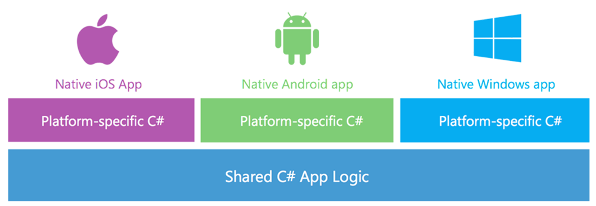
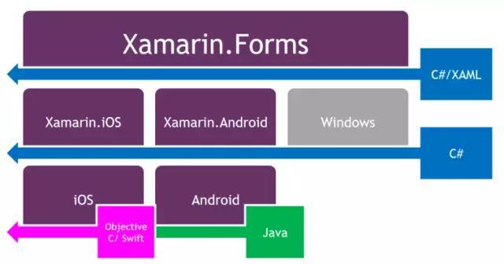
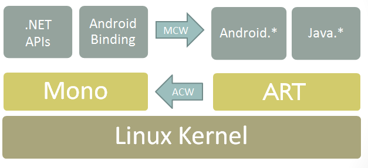

## Xamarin 是什么

使用 .net 技術完成所有平台共用的和無關的邏輯部分，由於各個平台的 UI 和交互不同，在使用由 Xamarin 封裝好的 C\# API 來訪問和操作 native 的控件，分別進行不同平台的 UI 開發。

主要幾項技術，Xamarin.Android、Xamarin.iOS、Xamarin.UWP 和 Xamarin.Forms 等。

### 工作原理

#### iOS 通過 AOT 靜態編譯成二進制運行

在 iOS 上，Xamarin 的預先 \(AOT靜態編譯\) 編譯器將 Xamarin.iOS 應用程序直接編譯到本機 ARM 程序集代碼。對於開發者來說，Xamarin.IOS相對於Xamarin.Android就要簡單很多了，我們用C\#開發的iOS應用程序在被編譯成IL代碼之後，然後轉交給Apple complier直接編譯成iOS的本地機器碼，也就是說C\#寫的iOS應用程序和Objective-C 寫的是一樣的。透過 Ahead-of-Time \(AOT\) 編譯程序，直接將Xamarin.iOS程序編譯為ARM的執行檔。編譯封裝完成的應用程序被直接編譯為原生的二進制執行文件。

#### Android 在啟動時通過 JIT 動態編譯

在 Android 上，Xamarin 編譯器則將應用編譯為中間語言 \(IL\)，隨後啟用應用程序時，再實時 \(JIT動態編譯\) 編譯為本機程序集。

##### Android Callable Wrappers（ACW）

使用 C\# 開發的Android應用程序在運行的時候，C\# 代碼是在 Mono 虛擬機中執行的，而 Mono 虛擬機是寄宿在Dalvik虛擬機中運行的，所有的 C\# 代碼都通過ACW的方式被調用。  
由於需要打包 Mono 環境，使用 C\# 開發的 Android 應用的 APK 文件會比原生開發的大，執行效率也會差一些。

##### Managed Callable Wrapper（MCW）

如果需要在 C\# 中調用一些系統的功能或者 Java 實現的類庫，該如何調用那？ 答案就是 MCW ，MCW 就是一個JNI橋梁，可以使用托管代碼調用 Android 的代碼。MCW 將整個 Android.\*  以及相關的命名空間通過 jar綁定的方式暴露出來，是的C\#可以調用。

## Xamarin 為什麽要使用

從各個平台底層業務代碼統一（web、mobile、desktop），界面開發統一。Xamarin.Forms 各平台 GUI 統一抽象，獲得原生平台的外觀和性能，但不適合開發圖形界面覆雜且頻繁的應用。遇到這情況可以使用Xamarin.Android、Xamarin.iOS 解決。Forms 的 mvvm 設計模式和綁定數據非常直觀，提高開發速度。

## Xamarin 能做什麽

構建 iOS 應用；構建 Android 應用；構建 Forms 跨平台應用；開發生產 iOS、Android 和 Windows Phone 的應用甚至遊戲，配合平台能做測試、數據分析等所有熱門功能，但不能熱更新。

## Xamarin 什麽時候用

適合規模較少，需要跨平台開發的項目；有 .net 底蘊的團隊，將資源分配到移動項目的團隊。

## Xamarin 適合什麽人使用

熟悉 C\# .NET 技術的開發人員；iOS 或 Android 經驗的開發人員

## Xamarin 與時下技術比較

|  | Xarmarin | Native App（Android/iOS） | WebApp（Angular、React） | Hybrid（phonegap/Cordova） | 基于JS的Native（RN） | PWA | U3D |
| :--- | :--- | :--- | :--- | :--- | :--- | :--- | :--- |
| 原生技术 | yes | yes |  | maybe 依賴接口 | yes |  | yes |
| 原生交互 |  |  |  | maybe 依賴接口 | yes |  | yes |
| 前端技术 |  |  | yes | yes | yes | yes | yes |
| 跨平台 | yes |  | yes | yes | yes | yes | yes |
| 本地交互 | yes | yes |  | maybe 依賴接口 | yes |  | yes |
| 免安装 |  |  | yes |  |  | yes | yes |
| 热更新 |  |  | yes | yes | yes 但 iOS 含有 jspatch 被禁止 | yes | yes |
| 性能 | 4 | 5 | 1 | 2 | 2 | 3 | 3 |

## Xamarin 缺點

#### 与最新版本的各种平台不兼容

與其他跨平台一樣，Xamarin建立在本機iOS操作系統和框架之上。對iOS，Android和Windows的最新平台更新有延遲支持。盡管擁有一個龐大的團隊，但Xamarin需要時間來適應iOS和Android的操作系統更改。

#### 有限的開源庫

儘管有 .NET 許多的開源庫，但是不能使用 iOS 或 Android 的第三方庫

#### 社區規模小

## 與 Xamarin 有關的用戶和產品

[http://www.cnblogs.com/cloudinfo/p/7286628.html](http://www.cnblogs.com/cloudinfo/p/7286628.html)

[https://www.xamarin.com/customers](https://www.xamarin.com/customers)

